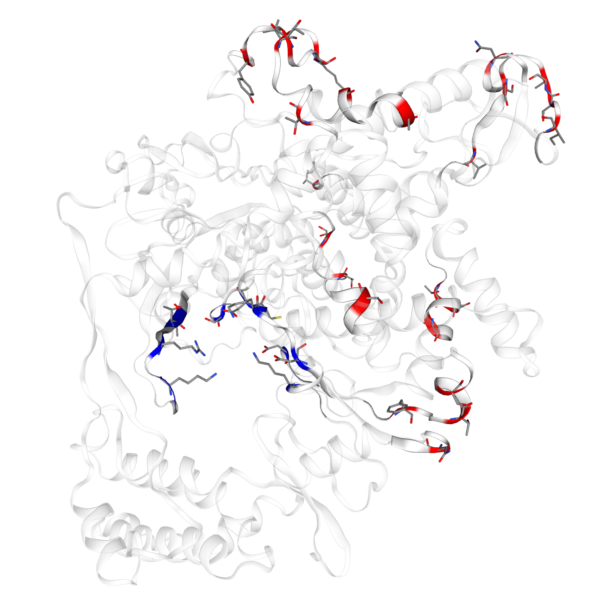

# Introduction

TODO:
- Description of problem
- Quick intro to annotation system based on SWISS-MODEL Repository [@Bienert-2017, @Waterhouse-2018]
- Introduce work done during BioHackathon

# Hackathon results

TODO:
- Subsection for each annotation effort

## Collection of annotation ideas

## Example code for annotations

To showcase the effort and provide an example of processing structures with
OpenStructure [@Biasini-2013], we extracted nucleotide binding residues for the
RNA-Polymerase as well as differences between SARS-CoV and SARS-CoV-2 in that
protein. This allowed to display both variations and the binding site on a
structure of the RNA-Polymerase (see figure \ref{RdRp_combined}). The variations
are extracted by aligning the UniProt-sequences P0DTD1 and P0C6X7 with a
pairwise Needleman-Wunsch algorithm and extracting an annotation for each
non-conserved amino acid. Insertions and deletions were ignored. An EM
structure exists for the RNA polymerase (PDB ID 6m71) but it does not contain
any ligands. We use structures from a study of viral RNA-Polymerases in
poliovirus [@PMID-17223130] which do contain nucleotides to map residues that
are expected to interact with nucleotides. The mapping is possible since despite
remote homology, the polymerase architecture is largely conserved and thus
allows for structural superpositions.

 
# Conclusion

TODO:
- Some conclusion summarizing the results

# Future work

TODO:
- Next steps?

# GitHub repository for data and scripts

* All annotations and scripts are stored here: https://github.com/SWISS-MODEL/covid-19-Annotations-on-Structures

# Acknowledgements
This work was done within the [Covid-19 Virtual BioHackathon 2020](https://github.com/virtual-biohackathons/covid-19-bh20).
We thank the organizers for the opportunity and the support.

# References
Shang, J., Ye, G., Shi, K., Wan, Y., Luo, C., Aihara, H., et al. (2020). Structural basis of receptor recognition by SARS-CoV-2. Nature, 1–8. doi:10.1038/s41586-020-2179-y.

Tai, W., He, L., Zhang, X., Pu, J., and Voronin, D. (2020). Characterization of the receptor-binding domain ( RBD ) of 2019 novel coronavirus : implication for development of RBD protein as a viral attachment inhibitor and vaccine. Cell. Mol. Immunol. doi:10.1038/s41423-020-0400-4.

Wan, Y., Shang, J., Graham, R., Baric, R. S., and Li, F. (2020). Receptor Recognition by the Novel Coronavirus from Wuhan: an Analysis Based on Decade-Long Structural Studies of SARS Coronavirus. J. Virol. 94, 1–9. doi:10.1128/jvi.00127-20.

Yuan, M., Yuan, M., Wu, N. C., Zhu, X., Lee, C. D., So, R. T. Y., et al. (2020). A highly conserved cryptic epitope in the receptor-binding domains of SARS-CoV-2 and SARS-CoV. 7269, 1–10.
